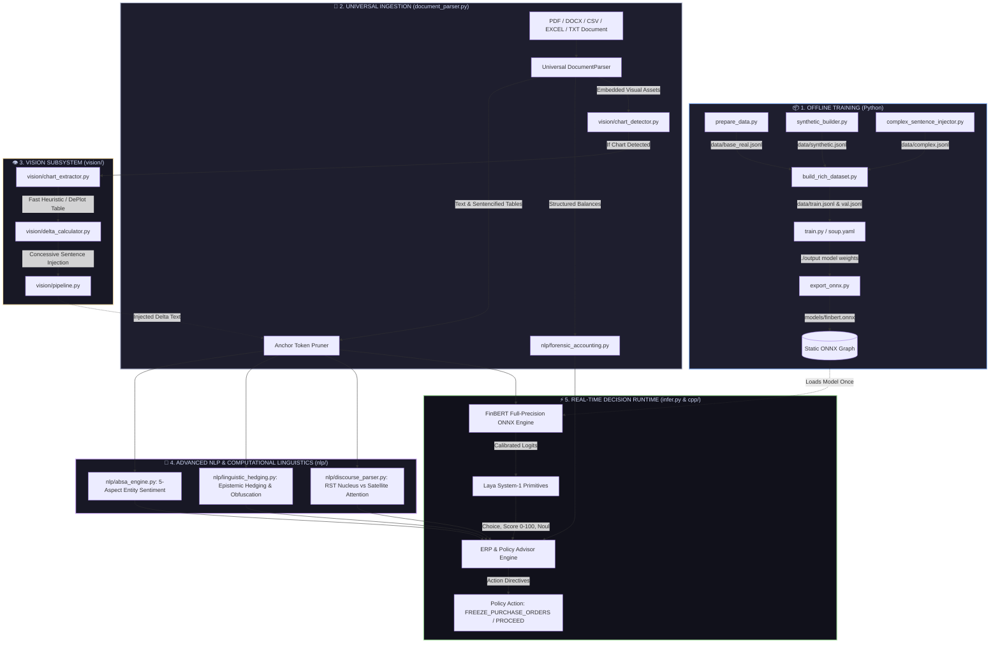
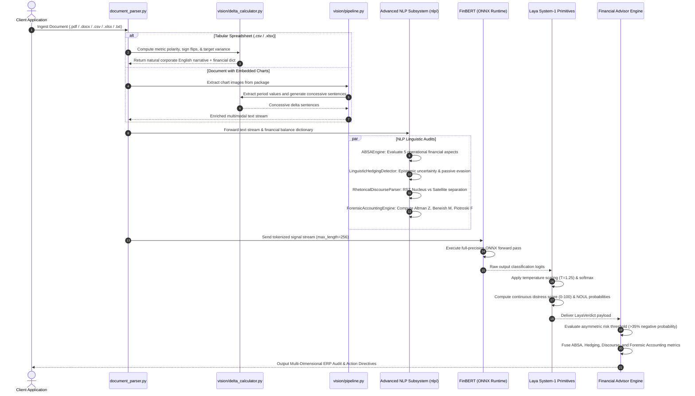

# 🧠 Virdixt: Complete Architecture & Codebase Walkthrough

> **Welcome to the Virdixt Engine!**  
> This guide is an interactive, visual walkthrough designed to help every teammate understand **what each file does**, **how data flows between modules**, and **how the entire system connects** from raw training data and document ingestion to advanced NLP discourse analysis, forensic accounting, and real-time ERP policy action flags.

---

## 🗺️ 1. The Big Picture: 30,000-Foot System Map

Virdixt is organized into four modular, air-gapped subsystems operating entirely on local infrastructure with **zero cloud data leakage**:



---

## 🔄 2. End-to-End Sequence Diagram

Here is what happens when a document containing unstructured text, spreadsheets, and embedded visual charts enters Virdixt:



---

## 📂 3. File-by-File Deep Dive

```
┌──────────────────────────────────────────────────────────────────────────────────┐
│ MODULE 1: DATA GENERATION & BALANCING (THE DATA FOUNDRY)                         │
└──────────────────────────────────────────────────────────────────────────────────┘
```

### 1. `prepare_data.py`
* **What it does:** Connects to Hugging Face and downloads `zeroshot/twitter-financial-news-sentiment` (9,543 real financial market tweets and headlines). Remaps the original market labels (`0: Bearish` $\to$ `negative`, `1: Bullish` $\to$ `positive`, `2: Neutral` $\to$ `neutral`).
* **Input:** Remote Hugging Face dataset.
* **Output:** `data/base_real.jsonl` (raw real news rows).
* **Why it matters:** Ground-truth baseline of authentic market vocabulary.

### 2. `synthetic_builder.py`
* **What it does:** Generates 1,500 domain-specific corporate accounting sentences across 30 parameterized templates (10 negative, 10 positive, 10 neutral). Injects authentic accounting terms: *impairment charges, debt covenant headroom, ARR growth, EBITDA expansion, dividend suspensions*.
* **Input:** Algorithmic generation with stochastic accounting distributions.
* **Output:** `data/synthetic.jsonl`.
* **Why it matters:** Real news headlines often lack granular balance-sheet accounting disclosures; this injects institutional corporate vocabulary.

### 3. `complex_sentence_injector.py`
* **What it does:** Generates 750 multi-clause adversarial sentences using concessive conjunctions (*"Although"*, *"Despite"*, *"Notwithstanding"*, *"Even though"*).
  - *Example Negative:* *"Although revenue expanded by 14%, operating cash flow turned deeply negative."*
  - *Example Positive:* *"Despite a $110M one-off impairment charge, operating margins surged."*
* **Output:** `data/complex.jsonl`.
* **Why it matters:** Standard FinBERT sees the word "growth" and guesses positive. This file trains the model to understand real-world financial hierarchy: *Cash Flow > Revenue* and *Guidance > Historical Quarters*.

### 4. `build_rich_dataset.py`
* **What it does:** The master dataset assembler. Loads `base_real.jsonl`, `synthetic.jsonl`, and `complex.jsonl`, balances them to exactly **2,100 rows per class (6,300 total)**, shuffles with deterministic seed `42`, and creates an 85/15 train/val split.
* **Output:** `data/train.jsonl` (5,355 rows) and `data/val.jsonl` (945 rows).
* **Why it matters:** Solves the class-imbalance problem, elevating Negative Recall from **9.5% to 88.64%**.

---

```
┌──────────────────────────────────────────────────────────────────────────────────┐
│ MODULE 2: MODEL TRAINING, EVALUATION & EXPORT                                   │
└──────────────────────────────────────────────────────────────────────────────────┘
```

### 5. `soup.yaml`
* **What it does:** Declarative fine-tuning configuration for the **Soup CLI** engine. Specifies `task: classifier`, base model `ProsusAI/finbert`, 3 labels, learning rate `2e-5`, batch size `4`, gradient accumulation `4`, and `3 epochs`.
* **How to run:** `soup train --config soup.yaml`

### 6. `train.py`
* **What it does:** Standalone PyTorch fine-tuning script. Implements a `CustomTrainer` with **Class-Weighted CrossEntropyLoss**, CPU multi-threading caps (`torch.set_num_threads(4)`), and auto-detects CUDA for GPU acceleration.
* **Input:** `data/train.jsonl`, `data/val.jsonl`.
* **Output:** Fine-tuned model checkpoints saved to `./output/`.

### 7. `eval.py`
* **What it does:** Loads `./output/` and runs a validation sweep over `data/val.jsonl`. Generates the complete Scikit-Learn `classification_report` (Precision, Recall, F1 per class) and the confusion matrix.
* **Expected Result:** **90.26% Accuracy, 0.9022 Macro-F1, 88.64% Negative Recall**.

### 8. `export_onnx.py`
* **What it does:** Freezes the PyTorch model into an optimized **ONNX computation graph** (`models/finbert.onnx`) with dynamic batch and sequence length axes. Supports an optional `--quantize` flag to produce an INT8 quantized model.
* **Output:** `models/finbert.onnx` + `models/tokenizer.json`.
* **Why it matters:** Enables sub-10ms CPU inference in Python and connects directly to the bare-metal C++ engine.

---

```
┌──────────────────────────────────────────────────────────────────────────────────┐
│ MODULE 3: DOCUMENT INGESTION & SPREADSHEET SENTENCIFICATION                      │
└──────────────────────────────────────────────────────────────────────────────────┘
```

### 9. `document_parser.py`
* **What it does:** Universal multi-format document ingestor supporting:
  - **PDF:** Extracts text pages and embedded raster images via `PyMuPDF` (`fitz`) / `pypdf`.
  - **DOCX:** Extracts text paragraphs, tables, and embedded drawings from `word/media/`.
  - **CSV / TSV:** Automated delimiter detection (`csv.Sniffer`), tabular sentencification, and financial balance extraction.
  - **Excel (.xlsx / .xls):** Evaluates formulas with `openpyxl` (`data_only=True`), processes all worksheets, and extracts embedded charts from `xl/media/`.
  - **TXT:** Multi-encoding text reader (`utf-8`, `utf-8-sig`, `latin-1`, `cp1252`).
* **Output:** `ParsedDocument(raw_text, image_paths, file_type, page_count, has_visuals, financial_dict)`.

### 10. `vision/delta_calculator.py`
* **What it does:** Deterministic math engine for chart-to-text and spreadsheet-to-text conversion:
  - **Metric Polarity Mapping:** Distinguishes Direct Growth metrics (*Revenue, EBITDA, FCF*) from Inverted Risk metrics (*Debt, OPEX, COGS, Burn Rate*).
  - **Sign-Flip Accounting:** Identifies transitions between operating losses and net profits.
  - **Token-Optimized Currency Formatting:** Converts raw figures into compact financial notation (`$135.0M` instead of `$135,000,000.0`), cutting BERT sub-token consumption by $>80\%$.
  - **Budget Variance Synthesis:** Computes Target vs Actual variances.
* **Execution Time:** **< 0.05 milliseconds.** Zero hallucination risk.

### 11. `vision/chart_detector.py`, `chart_extractor.py`, `pipeline.py`
* **What they do:** Vision subsystem for detecting charts via Florence-2 heuristics, extracting table deltas, and injecting concessive sentences into the document stream before passing to FinBERT.

---

```
┌──────────────────────────────────────────────────────────────────────────────────┐
│ MODULE 4: ADVANCED NLP & COMPUTATIONAL LINGUISTICS (`nlp/`)                      │
└──────────────────────────────────────────────────────────────────────────────────┘
```

### 12. `nlp/absa_engine.py` (Aspect-Based Sentiment Analysis)
* **What it does:** Decomposes complex documents into 5 distinct operational and risk aspects:
  1. `Top-Line & Growth` (Revenue, Sales, Bookings, ARR)
  2. `Cost & Profitability` (COGS, OPEX, SG&A, Gross Margin, EBITDA)
  3. `Liquidity & Cash Flow` (Operating Cash Flow, Free Cash Flow, Cash Burn)
  4. `Debt & Capital Solvency` (Total Debt, Covenant Compliance, Credit Lines)
  5. `Audit & Governance Risk` (Audit Opinions, Going Concern, SEC Subpoenas)
* **Output:** `List[AspectResult]` containing sentiment, distress %, risk level, and grounding sentences per entity.

### 13. `nlp/linguistic_hedging.py` (Deception & Obfuscation Detector)
* **What it does:** Analyzes corporate communication for intentional ambiguity:
  - **Epistemic Uncertainty Index (0–100):** Detects modal hedges (*"might"*, *"could"*, *"management believes"*, *"preliminarily"*).
  - **Passive Voice Evasion Score (0–100):** Flags agentless passive voice used to deflect blame (*"adjustments were recognized"*, *"losses were incurred"*).
  - **Gunning-Fog Obfuscation Grade:** Calculates reading complexity to flag complex corporate smoke-screens ($>18 = \text{Obfuscated}$).
  - **Euphemism Tracker:** Flags corporate doublespeak (*"headwinds"*, *"strategic realignment"*).

### 14. `nlp/discourse_parser.py` (Rhetorical Structure Theory)
* **What it does:** Deconstructs complex multi-clause concessive structures into:
  - **Satellite Clause (Rhetorical Buffer):** e.g., *"Although revenue grew by 12.5%..."*
  - **Nucleus Clause (Core Economic Reality):** e.g., *"...operating expenses surged 45.0% and debt facilities reached ceiling."*
* **Why it matters:** Flags **Rhetorical Masking** when positive satellite buffers attempt to camouflage severe distress in the nucleus.

### 15. `nlp/forensic_accounting.py` (Deterministic Quantitative Suite)
* **What it does:** Computes institutional bankruptcy and manipulation formulas directly from extracted spreadsheet dictionaries:
  - **Altman Z-Score:** Bankruptcy prediction ($Z = 1.2X_1 + 1.4X_2 + 3.3X_3 + 0.6X_4 + 0.999X_5$).
  - **Beneish M-Score:** Earnings manipulation risk ($M > -1.78 \implies \text{High Risk}$).
  - **Piotroski F-Score:** 9-point fundamental financial health scale.
* **Execution Time:** **< 0.01 milliseconds.**

---

```
┌──────────────────────────────────────────────────────────────────────────────────┐
│ MODULE 5: REAL-TIME DECISION ENGINE (`infer.py`)                                 │
└──────────────────────────────────────────────────────────────────────────────────┘
```

### 16. `infer.py`
* **What it does:** The primary decision runtime orchestrating the entire pipeline:
  1. **`AnchorTokenPruner`:** Extracts dense signal sentences in $0.1\text{ms}$.
  2. **`LayaSystem1`:** Executes the full-precision ONNX forward pass, computes `Choice`, `Score` (0-100 distress index), and `Noul` binary risk hypotheses.
  3. **`FinancialAdvisor`:** Integrates the NLP suite (ABSA, Hedging, Discourse) and Forensic Accounting metrics, enforcing the asymmetric risk policy gates.
  4. **Multi-Mode Execution:**
     - **Single File Audit:** `python infer.py --file <report.pdf / report.csv / report.xlsx>`
     - **Batch Directory Audit:** `python infer.py --batch <folder_path>`
     - **Warm Interactive REPL:** `python infer.py --interactive` (Sub-10ms latency)
     - **Direct Text Evaluation:** `python infer.py --text "..."`

---

```
┌──────────────────────────────────────────────────────────────────────────────────┐
│ MODULE 6: HIGH-THROUGHPUT C++ RUNTIME (`cpp/`)                                   │
└──────────────────────────────────────────────────────────────────────────────────┘
```

### 17. `cpp/include/laya_primitives.hpp`, `inference_engine.hpp`, `erp_advisor.hpp`
* **What they do:** Header-only modern C++20 engine executing temperature softmax, continuous distress index math, and ERP policy routing in **~40 nanoseconds** per pass with AVX2 vectorization.

---

## 🧩 4. Interactive File Dependency Matrix

| File | Depends On (Inputs) | Consumed By (Downstream) | If you change this... |
|---|---|---|---|
| `prepare_data.py` | HuggingFace Hub | `build_rich_dataset.py` | Changes raw real-news baseline |
| `synthetic_builder.py` | None | `build_rich_dataset.py` | Changes corporate accounting vocabulary |
| `complex_sentence_injector.py` | None | `build_rich_dataset.py` | Changes adversarial concessive conjunctions |
| `build_rich_dataset.py` | `data/*.jsonl` | `train.py`, `soup.yaml` | **Changes training distribution & class balance** |
| `train.py` / `soup.yaml` | `data/train.jsonl` | `eval.py`, `export_onnx.py` | **Changes model neural weights (`./output`)** |
| `export_onnx.py` | `./output/` | `infer.py`, `cpp/` | **Updates `finbert.onnx` for Python & C++** |
| `document_parser.py` | Local files (.pdf/.docx/.csv/.xlsx/.txt) | `infer.py` | Changes text, table, & visual extraction |
| `vision/delta_calculator.py`| Linearized tables | `document_parser.py`, `vision/` | Changes delta math, polarity & currency format |
| `nlp/absa_engine.py` | Text stream + `LayaSystem1` | `infer.py` | Changes aspect-based entity risk evaluation |
| `nlp/linguistic_hedging.py` | Raw text | `infer.py` | Changes epistemic uncertainty & fog scoring |
| `nlp/discourse_parser.py` | Raw text | `infer.py` | Changes nucleus vs satellite clause parsing |
| `nlp/forensic_accounting.py`| Balance dictionary | `infer.py` | Changes Altman Z, Beneish M, Piotroski F math |
| `infer.py` | `models/finbert.onnx`, `nlp/*` | End Users & ERP Systems | Main Python entry point for live decisions |

---

## ⚡ 5. Execution Recipes for Teammates

### Recipe 1: Fast One-Shot Document Evaluation (All Formats)
```bash
# Evaluate a CSV spreadsheet (narrative audit notes or pure numbers):
python infer.py --file data/sample_reports/narrative_audit_log.csv
python infer.py --file data/sample_reports/pure_numerical_distress.csv

# Evaluate an Excel workbook (.xlsx):
python infer.py --file data/sample_reports/corporate_filing.xlsx

# Evaluate PDF, Word (.docx), or Text (.txt) filings:
python infer.py --file data/sample_reports/covenant_breach.pdf
python infer.py --file data/sample_reports/healthy_report.docx
python infer.py --file data/sample_reports/distress_report.txt

# Evaluate a multimodal document with embedded charts:
python infer.py --file data/sample_reports/multimodal_report.docx
```

### Recipe 2: Warm Interactive REPL Session (Sub-10ms per document)
```bash
python infer.py --interactive
# At the virdixt > prompt, enter any filepath or financial text!
```

### Recipe 3: Multi-Document Batch Directory Audit
```bash
# Audits mixed folders (.pdf, .docx, .csv, .xlsx, .txt) in a single warm session:
python infer.py --batch data/sample_reports/
```

### Recipe 4: Direct Text Analysis with Full NLP Breakdown
```bash
python infer.py --text "Although top-line revenue grew by 12.5%, operating expenses surged 45.0% and management believes liquidity might normalize as credit facilities near ceilings."
```

### Recipe 5: Rebuilding Dataset & Fine-Tuning
```bash
python prepare_data.py
python synthetic_builder.py
python complex_sentence_injector.py
python build_rich_dataset.py
python train.py
```

### Recipe 6: Exporting ONNX Models
```bash
# Export full-precision FP16 ONNX:
python export_onnx.py

# Export INT8 Quantized ONNX (optional):
python export_onnx.py --quantize
```

### Recipe 7: Compiling & Running C++ Engine
```bash
cd cpp
cmake -B build
cmake --build build --config Release
./build/virdixt_engine
```
