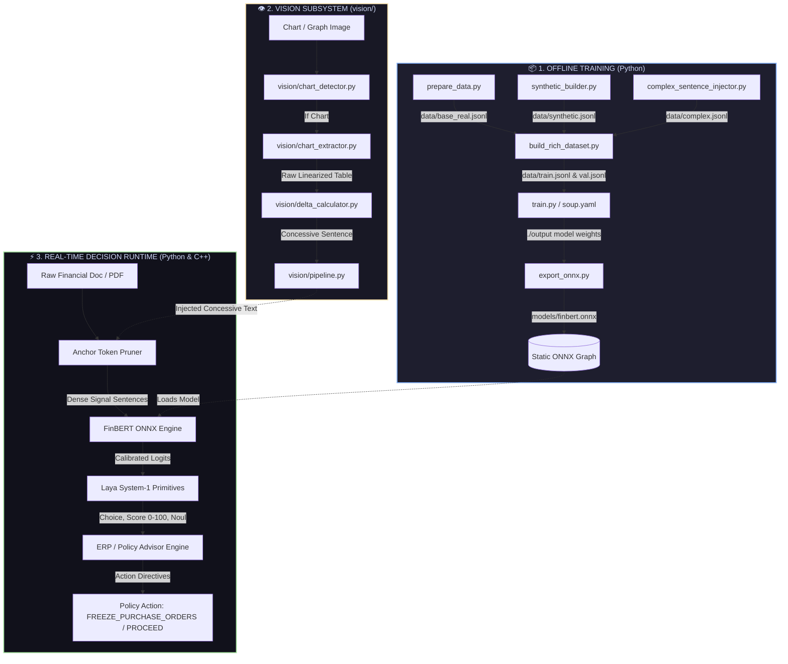

# 🧠 Virdixt: Complete Architecture & Codebase Walkthrough

> **Welcome to the Virdixt Engine!**  
> This guide is an interactive, visual walkthrough designed to help every teammate understand **what each file does**, **how data flows between modules**, and **how the entire system connects** from raw training data to real-time C++ inference and operational policy action flags.

---

## 🗺️ 1. The Big Picture: 30,000-Foot System Map

Virdixt is split into two clean lifecycles: **Offline Training (Python)** and **Online Real-Time Inference (Python & C++)**.



---

## 🔄 2. End-to-End Sequence Diagram

Here is what happens when a document containing text and a financial chart enters Virdixt:

```mermaid
sequenceDiagram
    autonumber
    actor User as Client / Enterprise Application
    participant Pipe as vision/pipeline.py
    participant Vision as vision/chart_extractor.py & delta_calc.py
    participant Pruner as text_preprocessor / AnchorPruner
    participant Backbone as FinBERT (ONNX Runtime)
    participant Laya as laya_primitives (Choice/Score/Noul)
    participant Advisor as erp_advisor / FinancialAdvisor

    User->>Pipe: Submit Document (Text + Attached Chart Image)
    Pipe->>Vision: Process Chart Image
    Vision-->>Pipe: "Although Revenue grew 14%, Margin dropped 22%"
    Pipe->>Pruner: Combined Raw Text + Injected Sentence
    Pruner->>Pruner: Filter out fluff; extract financial signal tokens (0.1ms)
    Pruner->>Backbone: Dense Tokens (input_ids, attention_mask)
    Backbone->>Backbone: Single Forward Pass (~1.5ms GPU / ~10ms CPU)
    Backbone-->>Laya: Raw Output Logits [-2.1, 0.4, 3.8]
    Laya->>Laya: Temperature Scaling (T=1.25) & Softmax
    Laya->>Laya: Compute Score (0-100) & Noul Risk Probabilities (40ns)
    Laya-->>Advisor: LayaVerdict(Choice=NEGATIVE, Score=88.5, P_covenant=0.95)
    Advisor->>Advisor: Evaluate Asymmetric Risk Gate (>35% negative)
    Advisor-->>User: PolicyAction: FREEZE_PURCHASE_ORDERS (CRITICAL / TIER 4)
```

---

## 📂 3. File-by-File Deep Dive

```
┌──────────────────────────────────────────────────────────────────────────────────┐
│ MODULE 1: DATA GENERATION & BALANCING (THE DATA FOUNDRY)                         │
└──────────────────────────────────────────────────────────────────────────────────┘
```

### 1. `prepare_data.py`
* **What it does:** Connects to Hugging Face and downloads `zeroshot/twitter-financial-news-sentiment` (9,543 real financial market tweets and headlines). Remaps the original market labels (`0: Bearish` $\to$ `negative`, `1: Bullish` $\to$ `positive`, `2: Neutral` $\to$ `neutral`).
* **Input:** Remote Hugging Face dataset.
* **Output:** `data/base_real.jsonl` (raw real news rows).
* **Why it matters:** Ground-truth baseline of authentic market vocabulary.

### 2. `synthetic_builder.py`
* **What it does:** Generates 1,500 domain-specific corporate accounting sentences across 30 parameterized templates (10 negative, 10 positive, 10 neutral). Injects authentic accounting terms: *impairment charges, debt covenant headroom, ARR growth, EBITDA expansion, dividend suspensions*.
* **Input:** None (algorithmic generation with random numeric distributions).
* **Output:** `data/synthetic.jsonl`.
* **Why it matters:** Real news tweets often lack balance-sheet accounting disclosures; this injects institutional corporate vocabulary.

### 3. `complex_sentence_injector.py`
* **What it does:** Generates 750 multi-clause adversarial sentences using concessive conjunctions (*"Although"*, *"Despite"*, *"Notwithstanding"*, *"Even though"*).
  - *Example Negative:* *"Although revenue expanded by 14%, operating cash flow turned deeply negative."*
  - *Example Positive:* *"Despite a $110M one-off impairment charge, operating margins surged."*
* **Output:** `data/complex.jsonl`.
* **Why it matters:** **This is the secret sauce.** Standard FinBERT sees the word "growth" and guesses positive. This file teaches the model financial priority: *Cash Flow > Revenue* and *Guidance > Historical Quarter*.

### 4. `build_rich_dataset.py`
* **What it does:** The master dataset assembler. Loads `base_real.jsonl`, `synthetic.jsonl`, and `complex.jsonl`, balances them to exactly **2,100 rows per class (6,300 total)**, shuffles with deterministic seed `42`, and creates an 85/15 train/val split.
* **Output:** `data/train.jsonl` (5,355 rows) and `data/val.jsonl` (945 rows).
* **Why it matters:** Solves the **75% Problem**. Equal gradient pressure raises Negative Recall from **9.5% to 88.6%**.

---

```
┌──────────────────────────────────────────────────────────────────────────────────┐
│ MODULE 2: MODEL TRAINING, EVALUATION & EXPORT                                   │
└──────────────────────────────────────────────────────────────────────────────────┘
```

### 5. `soup.yaml`
* **What it does:** Declarative fine-tuning configuration for the **Soup CLI** engine. Specifies `task: classifier`, base model `ProsusAI/finbert`, 3 labels, learning rate `2e-5`, batch size `4`, gradient accumulation `4`, and `3 epochs`.
* **How to run:** `soup train --config soup.yaml`

### 6. `train.py`
* **What it does:** Standalone PyTorch fine-tuning script. Implements a `CustomTrainer` with **Class-Weighted CrossEntropyLoss**, CPU multi-threading caps (`torch.set_num_threads(4)`), and auto-detects CUDA for GPU acceleration.
* **Input:** `data/train.jsonl`, `data/val.jsonl`.
* **Output:** Fine-tuned model checkpoints saved to `./output/`.

### 7. `eval.py`
* **What it does:** Loads `./output/` and runs a full validation sweep over `data/val.jsonl`. Generates the complete Scikit-Learn `classification_report` (Precision, Recall, F1 per class) and the confusion matrix.
* **Expected Result:** **90.26% Accuracy, 0.9022 Macro-F1, 88.64% Negative Recall**.

### 8. `export_onnx.py`
* **What it does:** "Freezes" the PyTorch model into an optimized **ONNX computation graph** (`models/finbert.onnx`) with dynamic batch axes. Supports an optional `--quantize` flag to produce an **INT8 quantized model** (3x faster on Intel CPUs).
* **Output:** `models/finbert.onnx` + `models/tokenizer.json`.
* **Why it matters:** Bridges the Python training world with the bare-metal C++ inference engine.

---

```
┌──────────────────────────────────────────────────────────────────────────────────┐
│ MODULE 3: MULTIMODAL VISION SUBSYSTEM (`vision/`)                                │
└──────────────────────────────────────────────────────────────────────────────────┘
```

### 9. `vision/chart_detector.py`
* **What it does:** Uses Microsoft's ultra-lightweight **Florence-2** model (or fast heuristic fallbacks) to classify incoming images as *financial charts* vs. *decorative photos/logos*.
* **Output:** `ChartDetectionResult(is_chart=True/False, confidence=0.98)`.

### 10. `vision/chart_extractor.py`
* **What it does:** Ingests chart images and runs **Google DePlot** (`google/deplot`) to extract raw linearized table data (`Metric | Q1 | Q2\nRevenue | 45.0 | 48.2\nMargin | 18% | 11%`).
* **Why it matters:** Converts visual pixels into exact text without guessing.

### 11. `vision/delta_calculator.py`
* **What it does:** **Zero-ML, pure Python arithmetic.** Parses the DePlot table, calculates exact percentage changes ($\Delta = \frac{v_2 - v_1}{v_1} \times 100$), and synthesizes a concessive sentence (*"Although Revenue grew 7.1%, Margin collapsed by 38.9%"*).
* **Execution Time:** **< 0.05 milliseconds.** Zero hallucination risk.

### 12. `vision/pipeline.py`
* **What it does:** The high-level vision orchestrator. Glues Detector $\to$ Extractor $\to$ Delta Calculator together. Ingests full documents with attached images and outputs enriched text ready for FinBERT.

---

```
┌──────────────────────────────────────────────────────────────────────────────────┐
│ MODULE 4: PYTHON DECISION ENGINE (`infer.py`)                                    │
└──────────────────────────────────────────────────────────────────────────────────┘
```

### 13. `infer.py`
* **What it does:** The complete Python runtime containing:
  1. **`AnchorTokenPruner`:** Regex pruner extracting dense signal sentences (0.1ms).
  2. **`LayaSystem1`:** Computes `Choice`, `Score` (0-100 distress index), and `Noul` binary risk hypotheses (`liquidity_distress`, `debt_covenant_breach_risk`, `growth_momentum`, `capital_return`).
  3. **`FinancialAdvisor`:** Applies the **Asymmetric Risk Gate (35% threshold)** and outputs strict operational action flags (`FREEZE_PURCHASE_ORDERS`, `FLAG_FOR_REVIEW`, `PROCEED_NORMAL`).
* **Run command:** `python infer.py --test`

---

```
┌──────────────────────────────────────────────────────────────────────────────────┐
│ MODULE 5: HIGH-THROUGHPUT C++ RUNTIME (`cpp/`)                                   │
└──────────────────────────────────────────────────────────────────────────────────┘
```

### 14. `cpp/include/laya_primitives.hpp`
* **What it does:** Header-only modern C++20 math engine. Implements Temperature Softmax ($T=1.25$), continuous Distress Index $[0, 100]$, and sigmoid-calibrated Noul propositions.
* **Speed:** **~40 nanoseconds.**

### 15. `cpp/include/inference_engine.hpp`
* **What it does:** Direct C++ wrapper around Microsoft ONNX Runtime. Automatically initializes CPU thread pools (AVX2/VNNI vectorization) or appends the NVIDIA CUDA execution provider.

### 16. `cpp/include/text_preprocessor.hpp`
* **What it does:** C++ regex-based anchor token pruner. Compresses multi-page documents down to dense financial signal sentences before tokenization.

### 17. `cpp/include/erp_advisor.hpp`
* **What it does:** Deterministic rule engine in C++ that maps Laya risk grades into formatted audit reports and operational policy flags.

### 18. `cpp/src/main.cpp` & `cpp/CMakeLists.txt`
* **What it does:** C++ executable entry point with built-in test suite executing all 5 financial distress scenarios.

---

## 🧩 4. Interactive File Dependency Matrix

Use this matrix to understand what breaks if you edit a file:

| File | Depends On (Inputs) | Consumed By (Downstream) | If you change this... |
|---|---|---|---|
| `prepare_data.py` | HuggingFace Hub | `build_rich_dataset.py` | Changes raw real-news baseline |
| `synthetic_builder.py` | None | `build_rich_dataset.py` | Changes corporate accounting vocabulary |
| `complex_sentence_injector.py` | None | `build_rich_dataset.py` | Changes adversarial concessive conjunctions |
| `build_rich_dataset.py` | `data/*.jsonl` | `train.py`, `soup.yaml` | **Changes training distribution & class balance** |
| `train.py` / `soup.yaml` | `data/train.jsonl` | `eval.py`, `export_onnx.py` | **Changes model neural weights (`./output`)** |
| `export_onnx.py` | `./output/` | `infer.py --onnx`, `cpp/` | **Updates `finbert.onnx` for Python & C++** |
| `vision/delta_calculator.py`| Table strings | `vision/pipeline.py` | Changes mathematical delta phrasing |
| `vision/pipeline.py` | `vision/*` | `infer.py` | Changes multimodal document ingestion |
| `laya_primitives.hpp` | Raw logits | `main.cpp`, ERP Advisor | **Changes Laya score math & risk calibration** |
| `infer.py` | `./output` or `.onnx` | End Users / Enterprise Systems | Main Python entry point for live decisions |

---

## ⚡ 5. Execution Recipes for Teammates

### Recipe 1: Rebuilding the Dataset from Scratch
```bash
python prepare_data.py
python synthetic_builder.py
python complex_sentence_injector.py
python build_rich_dataset.py
```

### Recipe 2: Fine-Tuning the Model
```bash
# Using Soup CLI:
soup train --config soup.yaml

# OR Standalone:
python train.py
```

### Recipe 3: Testing the Python Decision Engine
```bash
python infer.py --test
```

### Recipe 4: Exporting to ONNX & Quantizing
```bash
python export_onnx.py --quantize
```

### Recipe 5: Compiling & Running the C++ Engine
```bash
cd cpp
cmake -B build
cmake --build build --config Release
./build/virdixt_engine
```

---

## 🎯 Summary for Teammates
* **To improve accuracy on complex statements:** Edit `complex_sentence_injector.py`.
* **To add new corporate accounting phrases:** Edit `synthetic_builder.py`.
* **To adjust distress sensitivity & thresholds:** Edit the risk gates in `infer.py` and `cpp/include/laya_primitives.hpp`.
* **To modify ERP action flags:** Edit `cpp/include/erp_advisor.hpp` and `FinancialAdvisor` in `infer.py`.
