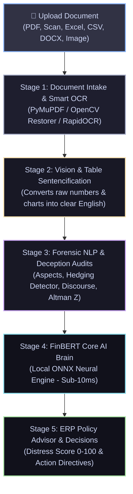
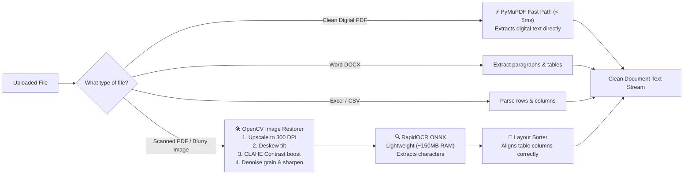
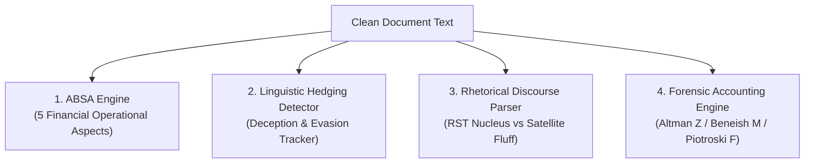
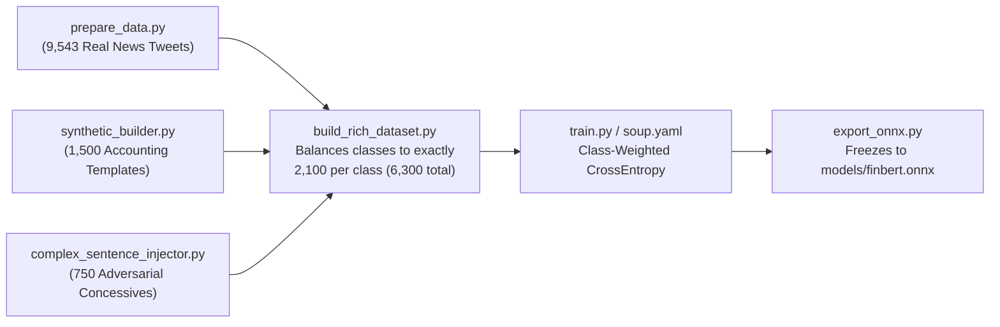

# 📘 Virdixt Architecture & System Walkthrough

> **Simple Summary:**  
> Virdixt is an air-gapped, local-first Financial Intelligence and NLP engine. It reads raw financial documents (PDFs, blurry scans, Excel sheets, Word files, images) and automatically audits them to answer three crucial questions:
> 1. **Is the company financially healthy or in distress?**
> 2. **Is management hiding bad news with evasive language or fake numbers?**
> 3. **What commercial action should the business take right now?** (e.g., *Freeze credit, require upfront cash, or proceed*).
>
> 🔒 **100% Private & Air-Gapped:** All processing runs entirely on your local machine. No data ever leaves the system.

---

## 🗺️ The 5-Stage Pipeline Overview

Here is how a document travels from raw input to executive action:


```mermaid
flowchart TD
    A["📄 Upload Document\n(PDF, Scan, Excel, CSV, DOCX, Image)"] --> S1["Stage 1: Document Intake & Smart OCR\n(PyMuPDF / OpenCV Restorer / RapidOCR)"]
    S1 --> S2["Stage 2: Vision & Table Sentencification\n(Converts raw numbers & charts into clear English)"]
    S2 --> S3["Stage 3: Forensic NLP & Deception Audits\n(Aspects, Hedging Detector, Discourse, Altman Z)"]
    S3 --> S4["Stage 4: FinBERT Core AI Brain\n(Local ONNX Neural Engine - Sub-10ms)"]
    S4 --> S5["Stage 5: ERP Policy Advisor & Decisions\n(Distress Score 0-100 & Action Directives)"]

    style A fill:#313244,stroke:#89b4fa,stroke-width:2px,color:#cdd6f4
    style S1 fill:#1e1e2e,stroke:#a6adc8,stroke-width:2px,color:#cdd6f4
    style S2 fill:#181825,stroke:#f9e2af,stroke-width:2px,color:#cdd6f4
    style S3 fill:#181825,stroke:#cba6f7,stroke-width:2px,color:#cdd6f4
    style S4 fill:#11111b,stroke:#89dceb,stroke-width:2px,color:#cdd6f4
    style S5 fill:#11111b,stroke:#a6e3a1,stroke-width:2px,color:#cdd6f4
```

---

## 🔍 Step-by-Step Deep Dive: What Happens at Every Stage

---

### 📂 Stage 1: Document Intake & Smart OCR
**Files involved:** [`document_parser.py`](file:///d:/Virdixt/document_parser.py), [`vision/image_enhancer.py`](file:///d:/Virdixt/vision/image_enhancer.py), [`vision/ocr_engine.py`](file:///d:/Virdixt/vision/ocr_engine.py)

#### 🎯 Goal
Take any file format and convert it into clean, readable text—even if it is a low-quality smartphone photo or a degraded photocopy.


```mermaid
flowchart LR
    In["Uploaded File"] --> Check{"What type of file?"}
    
    Check -- "Clean Digital PDF" --> Fast["⚡ PyMuPDF Fast Path (< 5ms)\nExtracts digital text directly"]
    Check -- "Word DOCX" --> Docx["Extract paragraphs & tables"]
    Check -- "Excel / CSV" --> Table["Parse rows & columns"]
    
    Check -- "Scanned PDF / Blurry Image" --> Restorer["🛠️ OpenCV Image Restorer\n1. Upscale to 300 DPI\n2. Deskew tilt\n3. CLAHE Contrast boost\n4. Denoise grain & sharpen"]
    
    Restorer --> OCR["🔍 RapidOCR ONNX\nLightweight (~150MB RAM)\nExtracts characters"]
    OCR --> Sorter["📐 Layout Sorter\nAligns table columns correctly"]
    
    Fast --> Out["Clean Document Text Stream"]
    Docx --> Out
    Table --> Out
    Sorter --> Out
```

#### 💡 How It Works
1. **Zero-Tax Fast Path:** If you upload a standard digital PDF (like an SEC 10-K filing), `PyMuPDF` extracts the text in **less than 5 milliseconds** using zero extra RAM.
2. **Automatic Scan Detector:** If the PDF has no digital text (e.g. an old scanned audit receipt or image-only PDF), Virdixt automatically detects this.
3. **OpenCV Image Restoration:** Blurry or faded scans are cleaned up *before* OCR:
   - **Deskewing:** Rotates crooked phone photos back to 0° alignment.
   - **CLAHE (Contrast Enhancement):** Rescues faint gray text from dark or yellowed paper.
   - **Bilateral Filtering:** Erases scanner noise and grain while keeping character edges razor-sharp.
   - **Unsharp Masking:** Sharpens out-of-focus camera photos.
4. **RapidOCR ONNX & Table Sorter:** Runs a lightweight neural OCR engine (<150MB RAM) that groups text boxes by vertical lines and sorts them left-to-right, ensuring table columns don't get scrambled.

---

### 📊 Stage 2: Vision & Table Sentencification
**Files involved:** [`vision/delta_calculator.py`](file:///d:/Virdixt/vision/delta_calculator.py), [`vision/chart_detector.py`](file:///d:/Virdixt/vision/chart_detector.py), [`vision/pipeline.py`](file:///d:/Virdixt/vision/pipeline.py)

#### 🎯 Goal
Language models are built for sentences, not raw grids of numbers. This stage converts spreadsheets, tables, and visual charts into clear, natural English narratives.

#### 💡 How It Works
1. **Metric Polarity Mapping:** The system knows that for **Revenue**, higher is good (+20% = positive), but for **Debt** or **Operating Expenses**, higher is dangerous (+20% = negative).
2. **Sign-Flip Accounting:** Automatically flags when a company went from profitable to losing money (e.g., *“Net income flipped from positive \$2.5M to a net loss of (\$1.2M)”*).
3. **Token-Optimized Currency Formatting:** Converts raw numbers (`$12,450,000.00`) into compact tokens (`$12.5M`), saving $>80\%$ of token memory.
4. **Visual Chart Ingestion:** If an embedded chart image is detected inside a PDF or Excel sheet, it extracts the visual data points and injects the delta sentences directly into the document text.

---

### 🧠 Stage 3: Advanced Forensic NLP & Deception Audits
**Files involved:** [`nlp/absa_engine.py`](file:///d:/Virdixt/nlp/absa_engine.py), [`nlp/linguistic_hedging.py`](file:///d:/Virdixt/nlp/linguistic_hedging.py), [`nlp/discourse_parser.py`](file:///d:/Virdixt/nlp/discourse_parser.py), [`nlp/forensic_accounting.py`](file:///d:/Virdixt/nlp/forensic_accounting.py)

#### 🎯 Goal
Go far beyond generic sentiment by performing 4 deep linguistic and mathematical forensic audits:


```mermaid
flowchart TD
    Text["Clean Document Text"] --> A["1. ABSA Engine\n(5 Financial Operational Aspects)"]
    Text --> B["2. Linguistic Hedging Detector\n(Deception & Evasion Tracker)"]
    Text --> C["3. Rhetorical Discourse Parser\n(RST Nucleus vs Satellite Fluff)"]
    Text --> D["4. Forensic Accounting Engine\n(Altman Z / Beneish M / Piotroski F)"]
```

#### 💡 The 4 Forensic Checks:

| Audit Module | What It Looks For | Real-World Example |
| :--- | :--- | :--- |
| **1. ABSA Engine** *(Aspect-Based Sentiment)* | Breaks the company into 5 pillars: **Top-Line Growth**, **Cost & Profitability**, **Liquidity & Cash**, **Debt Solvency**, and **Audit Risk**. | A company might have great Revenue (Positive), but collapsing Cash Flow (Critical Risk). ABSA flags them separately. |
| **2. Linguistic Hedging** *(Deception Tracker)* | Flags corporate smoke-screens, modal verbs (*"might"*, *"could"*), and passive voice (*"mistakes were made"*). | Calculates **Epistemic Uncertainty (0–100)** and **Gunning-Fog Reading Grade** to catch intentional obfuscation. |
| **3. Rhetorical Discourse (RST)** | Identifies the *Core Truth (Nucleus)* vs the *Excuse/Fluff (Satellite)* using concessive grammar (*"Although..."*, *"Despite..."*). | Sentence: *"Although sales rose 10%, cash flow cratered."*<br>👉 Identifies *Cash Flow Cratered* as the primary truth. |
| **4. Forensic Accounting** | Applies Nobel-prize winning statistical accounting formulas to balance-sheet data. | **Altman Z-Score:** Predicts bankruptcy probability.<br>**Beneish M-Score:** Flags fraudulent earnings manipulation.<br>**Piotroski F-Score:** Scores financial strength (0 to 9). |

---

### ⚡ Stage 4: FinBERT Core AI Brain (Inference)
**Files involved:** [`infer.py`](file:///d:/Virdixt/infer.py), [`models/finbert.onnx`](file:///d:/Virdixt/models/finbert.onnx)

#### 🎯 Goal
Execute fast, calibrated neural classification on the processed text in under **10 milliseconds** using full-precision ONNX Runtime on your local CPU.

#### 💡 How It Works
1. **Token Pruning:** Trims unnecessary filler words and focuses attention on anchor accounting tokens.
2. **ONNX Graph Execution:** Loads the fine-tuned FinBERT model graph directly into memory once.
3. **Temperature Calibration:** Uses temperature scaling ($T=1.25$) on raw neural outputs so probabilities reflect real-world statistical confidence rather than overconfident guesses.
4. **Laya System-1 Continuous Distress Index:** Converts discrete labels (`Positive`, `Neutral`, `Negative`) into a smooth **Distress Score from 0.0 (Peak Financial Health) to 100.0 (Imminent Insolvency)**.

---

### 🛡️ Stage 5: ERP Policy Advisor & Commercial Actions
**Files involved:** [`infer.py`](file:///d:/Virdixt/infer.py)

#### 🎯 Goal
Translate the AI analysis into concrete business actions for ERP and procurement systems (SAP, Oracle, NetSuite).

#### 💡 How It Works
Virdixt uses an **Asymmetric Risk Rule**: In corporate finance, failing to catch a bankruptcy is 10x worse than being overly cautious.
* If **Negative Probability $> 35\%$** or **Distress Index $> 65.0$**, Virdixt flags a high-risk policy violation.
* Generates concrete actionable instructions:
  - 🚨 `FREEZE_PURCHASE_ORDERS`: Stop shipping goods on credit immediately.
  - 💵 `REQUIRE_UPFRONT_CASH`: Shift customer to 100% upfront wire transfer.
  - 📑 `AUDIT_DEBT_COVENANTS`: Demand audited bank compliance certificates.
  - ✅ `PROCEED_STANDARD_TERMS`: Safe for standard Net-30/Net-60 commercial credit.

---

## 🏭 The Training Foundry (How the Model Was Trained)

Why didn't we just use off-the-shelf FinBERT?
Standard FinBERT gets tricked easily: if a headline says *"Sales grew 20% but company went bankrupt"*, it sees "grew" and incorrectly predicts *Positive*.

We rebuilt the dataset and training pipeline from the ground up:


```mermaid
flowchart LR
    R1["prepare_data.py\n(9,543 Real News Tweets)"] --> MB["build_rich_dataset.py\nBalances classes to exactly\n2,100 per class (6,300 total)"]
    R2["synthetic_builder.py\n(1,500 Accounting Templates)"] --> MB
    R3["complex_sentence_injector.py\n(750 Adversarial Concessives)"] --> MB
    
    MB --> Train["train.py / soup.yaml\nClass-Weighted CrossEntropy"]
    Train --> Export["export_onnx.py\nFreezes to models/finbert.onnx"]
```

1. **[`prepare_data.py`](file:///d:/Virdixt/prepare_data.py):** Downloads authentic financial news headlines and maps labels cleanly.
2. **[`synthetic_builder.py`](file:///d:/Virdixt/synthetic_builder.py):** Generates 1,500 domain-specific accounting statements (*impairment charges, debt covenant headroom, EBITDA margin*).
3. **[`complex_sentence_injector.py`](file:///d:/Virdixt/complex_sentence_injector.py):** Injects 750 complex sentences using *"Although"*, *"Despite"*, and *"Notwithstanding"*, teaching the model that **Cash Flow always beats Revenue**.
4. **[`build_rich_dataset.py`](file:///d:/Virdixt/build_rich_dataset.py):** Balances all 3 classes to exactly **2,100 rows each**, eliminating model bias.
5. **[`train.py`](file:///d:/Virdixt/train.py):** Fine-tunes FinBERT with class-weighted loss and multi-threading caps.
6. **[`eval.py`](file:///d:/Virdixt/eval.py):** Validates accuracy: achieves **90.26% Accuracy and 88.64% Negative Recall**.
7. **[`export_onnx.py`](file:///d:/Virdixt/export_onnx.py):** Freezes the trained PyTorch weights into a lightweight `models/finbert.onnx` file.

---

## 📁 Complete File Directory Reference

| File Path | Primary Function |
| :--- | :--- |
| [`document_parser.py`](file:///d:/Virdixt/document_parser.py) | Master multi-format ingestion for PDF, DOCX, CSV, Excel, TXT, and Images with automatic scan detection. |
| [`vision/image_enhancer.py`](file:///d:/Virdixt/vision/image_enhancer.py) | OpenCV image restoration: CLAHE contrast, bilateral denoising, deskewing, and unsharp stroke sharpening. |
| [`vision/ocr_engine.py`](file:///d:/Virdixt/vision/ocr_engine.py) | RapidOCR ONNX engine (<150MB RAM) with geometric bounding-box layout sorting for tables. |
| [`vision/delta_calculator.py`](file:///d:/Virdixt/vision/delta_calculator.py) | Deterministic math engine that translates tabular numbers and charts into natural English sentences. |
| [`nlp/absa_engine.py`](file:///d:/Virdixt/nlp/absa_engine.py) | Aspect-Based Sentiment Analysis scoring Top-Line, Profitability, Liquidity, Solvency, and Audit risks. |
| [`nlp/linguistic_hedging.py`](file:///d:/Virdixt/nlp/linguistic_hedging.py) | Deception detection: Epistemic uncertainty index, passive voice evasion, and Gunning-Fog readability grade. |
| [`nlp/discourse_parser.py`](file:///d:/Virdixt/nlp/discourse_parser.py) | Rhetorical Structure Theory (RST) parsing separating primary facts (nuclei) from excuses (satellites). |
| [`nlp/forensic_accounting.py`](file:///d:/Virdixt/nlp/forensic_accounting.py) | Quantitative forensic math: Altman Z-Score, Beneish M-Score, and Piotroski F-Score. |
| [`infer.py`](file:///d:/Virdixt/infer.py) | Command-line runtime integrating all modules, executing ONNX inference, and producing ERP audit tables. |
| [`test_ocr_pipeline.py`](file:///d:/Virdixt/test_ocr_pipeline.py) | Verification test suite for degraded scan restoration, ONNX OCR, and PDF fallback. |
| [`requirements.txt`](file:///d:/Virdixt/requirements.txt) | Complete local dependencies (Torch, Transformers, ONNX Runtime, OpenCV, RapidOCR, PyMuPDF). |

---

## 🚀 Quick Commands Cheatsheet

```bash
# 1. Audit any document (PDF, Scanned Image, DOCX, Excel, CSV, TXT)
python infer.py --file "sample_financials.pdf"

# 2. Audit raw corporate text directly
python infer.py --text "Although revenue rose by 14%, cash flow turned deeply negative."

# 3. Run OCR & Image Restoration Verification Test Suite
python test_ocr_pipeline.py

# 4. Re-evaluate Model Accuracy & Recall
python eval.py
```
