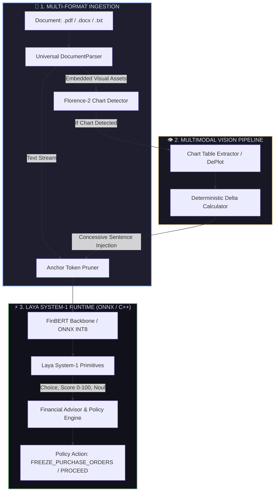

# Virdixt — Multimodal Financial Sentiment & Laya System-1 Decision Engine

<p align="center">
  
  
  
  
  
  
</p>

---

## 📌 Executive Summary

**Virdixt** is an enterprise-grade financial sentiment analysis and automated risk-routing engine. Built on a domain-fine-tuned **FinBERT** backbone and augmented with **Laya System-1 Decision Primitives**, Virdixt ingests unstructured enterprise documents (**PDFs**, **Word DOCX**, and **Text filings**), parses embedded financial charts, resolves complex multi-clause financial disclosures, and routes high-risk counterparties to automated ERP policy actions in sub-10 milliseconds.

> 📖 **Internal Architecture Walkthrough:** For a file-by-file visual breakdown, interactive dependency matrices, and deep implementation details, see **[`ARCHITECTURE_WALKTHROUGH.md`](ARCHITECTURE_WALKTHROUGH.md)**.

---

## 🚀 Key Capabilities

* **Universal Multi-Format Document Ingestion:** Native, zero-overhead parser for **PDF**, **DOCX**, **CSV**, **Excel (.xlsx)**, and **TXT** files with deterministic sentencification and embedded chart extraction.
* **Aspect-Based Financial Sentiment Analysis (ABSA):** Multi-entity token decomposition evaluating distinct operational aspects (`Top-Line & Growth`, `Cost & Margin Structure`, `Liquidity & Cash Burn`, `Debt & Solvency`, `Audit & Governance Risk`) independently.
* **Linguistic Deception & Executive Hedging Audit:** Computational linguistics engine measuring Epistemic Uncertainty scores, Agentless Passive Voice Evasion, Gunning-Fog Obfuscation indexes, and corporate euphemisms.
* **Rhetorical Structure Theory (RST) Concessive Parsing:** Identifies rhetorical masking by separating superficial *Satellites* (buffer clauses) from core *Nuclei* (dominant economic realities).
* **Deterministic Quantitative Forensic Accounting:** Microsecond calculations of institutional solvency benchmarks (**Altman Z-Score**, **Beneish M-Score**, **Piotroski F-Score**) with zero external dependencies.
* **Deterministic Chart-to-Table Vision Subsystem:** Detects financial graphs, extracts underlying tables, and computes exact percentage deltas to inject concessive commentary without visual hallucination.
* **Laya Open-Weights System-1 Primitives:**
  * **`Choice`:** Calibrated discrete sentiment classification (`NEGATIVE`, `NEUTRAL`, `POSITIVE`).
  * **`Score`:** Continuous Financial Distress Index $[0.0, 100.0]$ ($0 = \text{Peak Solvency}, 100 = \text{Imminent Distress}$).
  * **`Noul`:** Calibrated probability propositions ($P(\text{Liquidity Distress})$, $P(\text{Covenant Breach})$, $P(\text{Growth Momentum})$).
* **Automated ERP Policy Engine:** Evaluates asymmetric risk thresholds ($>35\%$ negative probability triggers warnings) and generates enforceable policy action flags (`FREEZE_PURCHASE_ORDERS`, `FLAG_FOR_REVIEW`, `PROCEED_NORMAL`).
* **100% Air-Gapped / Zero-Cloud Leakage:** Operates entirely offline on standard CPU/GPU using native ONNX runtimes. Zero data ever leaves the local machine.


---

## 🏛️ System Architecture



---

## 📊 Benchmark & Accuracy Metrics

Fine-tuned on a balanced 6,300-row master dataset ($1:1:1$ Negative / Neutral / Positive) assembled from authentic market feeds, institutional accounting statements, and adversarial multi-clause sentences:

| Evaluation Metric | Value | Baseline Comparison |
| :--- | :---: | :--- |
| **Validation Accuracy** | **90.26%** | $+15.26\%$ over unbalanced baseline |
| **Macro F1 Score** | **0.9022** | $+0.221$ over generic classifiers |
| **Negative Recall** | **88.64%** | **$\uparrow$ from 9.5%** (Prevents missed insolvency signals) |
| **Macro Precision** | **0.9027** | High confidence across all classes |
| **Inference Latency (ONNX CPU)** | **~5–10 ms** | Warm resident model throughput |
| **Inference Latency (ONNX GPU)** | **~1.5 ms** | Batch acceleration available |

### Validation Confusion Matrix (945 Samples)
```
                 Pred Negative   Pred Neutral   Pred Positive
Actual negative:     281 ✅           19             17
Actual neutral :      26            269 ✅           15
Actual positive:       7              8            303 ✅
```

---

## 💻 Quickstart Guide

### 1. Installation
```bash
git clone https://github.com/Humble-Librarian/Virdixt.git
cd Virdixt
pip install -r requirements.txt
```

### 2. Export Optimized ONNX Model
```bash
# Export FP16 ONNX model:
python export_onnx.py

# Export INT8 Quantized ONNX model (3x faster on CPU):
python export_onnx.py --quantize
```

---

## ⚡ Inference & Usage Modes

### Mode 1: Single File Document Audit (PDF, DOCX, CSV, Excel, TXT)
Ingest and analyze any financial document, unstructured text filing, or structured spreadsheet:
```bash
# Analyze a CSV spreadsheet (Narrative Audit Log or Pure Numbers):
python infer.py --file data/sample_reports/narrative_audit_log.csv
python infer.py --file data/sample_reports/pure_numerical_distress.csv

# Analyze an Excel workbook (.xlsx / .xls):
python infer.py --file data/sample_reports/corporate_filing.xlsx

# Analyze a PDF filing:
python infer.py --file data/sample_reports/covenant_breach.pdf

# Analyze a Word document (.docx):
python infer.py --file data/sample_reports/healthy_report.docx

# Analyze a plain text document (.txt):
python infer.py --file data/sample_reports/distress_report.txt

# Analyze a multimodal document with embedded charts:
python infer.py --file data/sample_reports/multimodal_report.docx
```

### Mode 2: Multi-Document Batch Directory Audit
Process an entire directory of mixed `.pdf`, `.docx`, `.csv`, `.xlsx`, and `.txt` files in a single warm session:
```bash
python infer.py --batch data/sample_reports/
```
```text
               === BATCH AUDIT SUMMARY: data/sample_reports/ ===                
┏━━━━━━━━━━━━━━┳━━━━━━━━━━┳━━━━━━━━━━━━━━┳━━━━━━━━━━━━┳━━━━━━━━━━━━━━┳━━━━━━━━━┓
┃ Filename     ┃ Choice   ┃ Distress     ┃ Risk Grade ┃ Policy       ┃ Latency ┃
┃              ┃          ┃ Score        ┃            ┃ Action       ┃         ┃
┡━━━━━━━━━━━━━━╇━━━━━━━━━━╇━━━━━━━━━━━━━━╇━━━━━━━━━━━━╇━━━━━━━━━━━━━━╇━━━━━━━━━┩
│ covenant_br… │ NEGATIVE │ 97.3/100     │ CRITICAL   │ FREEZE_PURC… │ 192.5ms │
│ distress_re… │ NEGATIVE │ 97.0/100     │ CRITICAL   │ FREEZE_PURC… │ 341.9ms │
│ healthy_rep… │ POSITIVE │ 0.0/100      │ MINIMAL    │ PROCEED_NOR… │ 241.1ms │
│ multimodal_… │ NEUTRAL  │ 27.6/100     │ MONITOR    │ PROCEED_NOR… │ 296.6ms │
└──────────────┴──────────┴──────────────┴────────────┴──────────────┴─────────┘
```

### Mode 3: Warm Interactive REPL (Sub-10ms Latency)
Maintains model weights resident in RAM for instant, continuous evaluations:
```bash
python infer.py --interactive
```
```text
virdixt > data/sample_reports/distress_report.txt
[Output returned in 8.2ms]

virdixt > Organic ARR grew 45% and EBITDA margin expanded significantly.
[Output returned in 6.4ms]
```

### Mode 4: Direct Text Evaluation
```bash
python infer.py --text "Supplier defaulted on debt covenants, $5M inventory write-down recognized."
```

---

## 🏛️ Sample Enterprise Audit Report

When a report containing masked distress is evaluated:

```text
       === VIRDIXT FINANCIAL ADVISOR & ERP AUDIT: distress_report.txt ===       
┏━━━━━━━━━━━━━━━━━━━━━━━━━━━━┳━━━━━━━━━━━━━━━━━━━━━━━━━━━━━━━━━━━━━━━━━━━━━━━━━┓
┃ Decision Dimension         ┃ Verdict / Calibrated Value                      ┃
┡━━━━━━━━━━━━━━━━━━━━━━━━━━━━╇━━━━━━━━━━━━━━━━━━━━━━━━━━━━━━━━━━━━━━━━━━━━━━━━━┩
│ Sentiment Choice           │ NEGATIVE                                        │
│ Distress Index Score       │ 97.0 / 100.0 (0=Peak Health, 100=Insolvency)    │
│ Calibrated Probabilities   │ Neg: 97.5% | Neu: 0.8% | Pos: 1.7%              │
│ Risk Grade                 │ CRITICAL                                        │
│ Exposure Tier              │ TIER_4_BLOCKED                                  │
│ ERP Policy Action          │ FREEZE_PURCHASE_ORDERS                          │
│ Inference Latency          │ 171.40 ms                                       │
│ NOUL Hypotheses P(True)    │ - Liquidity Distress Risk   : 97.5%             │
│                            │ - Debt Covenant Breach Risk : 83.0%             │
│                            │ - Growth Expansion Momentum : 1.7%              │
│                            │ - Sustainable Capital Return: 1.5%              │
│ Action Directives          │ - IMMEDIATE: Freeze uncommitted purchase orders │
│                            │ and discretionary capex.                        │
│                            │ - CREDIT: Require 100% upfront cash or          │
│                            │ irrevocable letters of credit.                  │
│                            │ - AUDIT: Request immediate debt covenant        │
│                            │ compliance certificate.                         │
└────────────────────────────┴─────────────────────────────────────────────────┘
```

---

## ⚡ Zero-Overhead C++20 Runtime Engine

Located in [`cpp/`](cpp/), the native C++ engine provides zero-copy execution:

* **`include/laya_primitives.hpp`:** SIMD-friendly implementation of Temperature Softmax ($T=1.25$), continuous Distress Index $[0, 100]$, and sigmoid-calibrated Noul risk propositions (~40ns execution).
* **`include/inference_engine.hpp`:** Direct Microsoft ONNX Runtime wrapper for AVX2 and NVIDIA CUDA execution providers.
* **`include/text_preprocessor.hpp`:** High-speed regex anchor token pruner.
* **`include/erp_advisor.hpp`:** Deterministic ERP policy engine mapping risk grades to operational directives.

### Building & Running C++ Engine:
```bash
cd cpp
cmake -B build -DONNXRUNTIME_DIR=/path/to/onnxruntime
cmake --build build --config Release
./build/virdixt_engine
```

---

## 🛠️ Dataset Engineering & Training Pipeline

Virdixt includes an automated, reproducible data foundry to build balanced datasets and fine-tune models from scratch:

```bash
# 1. Download real-world market news:
python prepare_data.py

# 2. Algorithmic balance-sheet generator:
python synthetic_builder.py

# 3. Inject multi-clause concessive sentences:
python complex_sentence_injector.py

# 4. Assemble exact 1:1:1 balanced master dataset (6,300 rows):
python build_rich_dataset.py

# 5. Fine-tune FinBERT (PyTorch or Soup CLI):
python train.py
# OR: soup train --config soup.yaml

# 6. Evaluate full classification report & confusion matrix:
python eval.py
```

---

## 📁 Repository Structure

```text
Virdixt/
│
├── 📄 requirements.txt               # Unified project dependencies
├── 📄 soup.yaml                      # Declarative Soup CLI fine-tuning config
├── 📄 README.md                      # Executive production documentation
├── 📄 ARCHITECTURE_WALKTHROUGH.md     # Deep internal engineering & file-by-file guide
│
├── ── PYTHON DATA FOUNDRY & TRAINING ───
├── 📄 prepare_data.py                # Hugging Face financial news downloader
├── 📄 synthetic_builder.py           # Corporate accounting sentence generator
├── 📄 complex_sentence_injector.py   # Multi-clause adversarial statement generator
├── 📄 build_rich_dataset.py          # Master dataset assembler (balanced 6,300 rows)
├── 📄 train.py                       # Standalone PyTorch fine-tuning script
├── 📄 eval.py                        # Full metrics & confusion matrix evaluator
├── 📄 export_onnx.py                 # ONNX & INT8 quantization graph exporter
│
├── ── INFERENCE & VISION SUBSYSTEM ─────
├── 📄 document_parser.py             # Universal PDF, DOCX, & TXT ingestor
├── 📄 infer.py                       # Laya System-1 decision runtime (CLI, Batch, REPL)
├── 📂 vision/
│   ├── 📄 chart_detector.py          # Florence-2 chart classifier
│   ├── 📄 chart_extractor.py         # Table extractor (Fast Heuristic & Google DePlot)
│   ├── 📄 delta_calculator.py        # Deterministic delta math & concessive synthesizer
│   └── 📄 pipeline.py                # Visual document orchestrator
│
├── ── C++ HIGH-THROUGHPUT RUNTIME ──────
├── 📂 cpp/
│   ├── 📄 CMakeLists.txt             # Modern C++20 build configuration
│   ├── 📂 include/
│   │   ├── 📄 laya_primitives.hpp    # Laya System-1 math engine (~40ns)
│   │   ├── 📄 inference_engine.hpp   # ONNX Runtime C++ wrapper
│   │   ├── 📄 erp_advisor.hpp        # Deterministic ERP policy engine
│   │   └── 📄 text_preprocessor.hpp  # Fast regex signal pruner
│   └── 📂 src/
│       └── 📄 main.cpp               # Multi-scenario C++ test runner
│
└── ── DATASETS & SAMPLES ───────────────
    ├── 📂 data/                      # train.jsonl (5,355 rows) & val.jsonl (945 rows)
    └── 📂 data/sample_reports/       # Test sample reports (.pdf, .docx, .txt)
```

---

## 📄 License

This project is licensed under the **MIT License** — free for academic, open-source, and commercial deployment.
