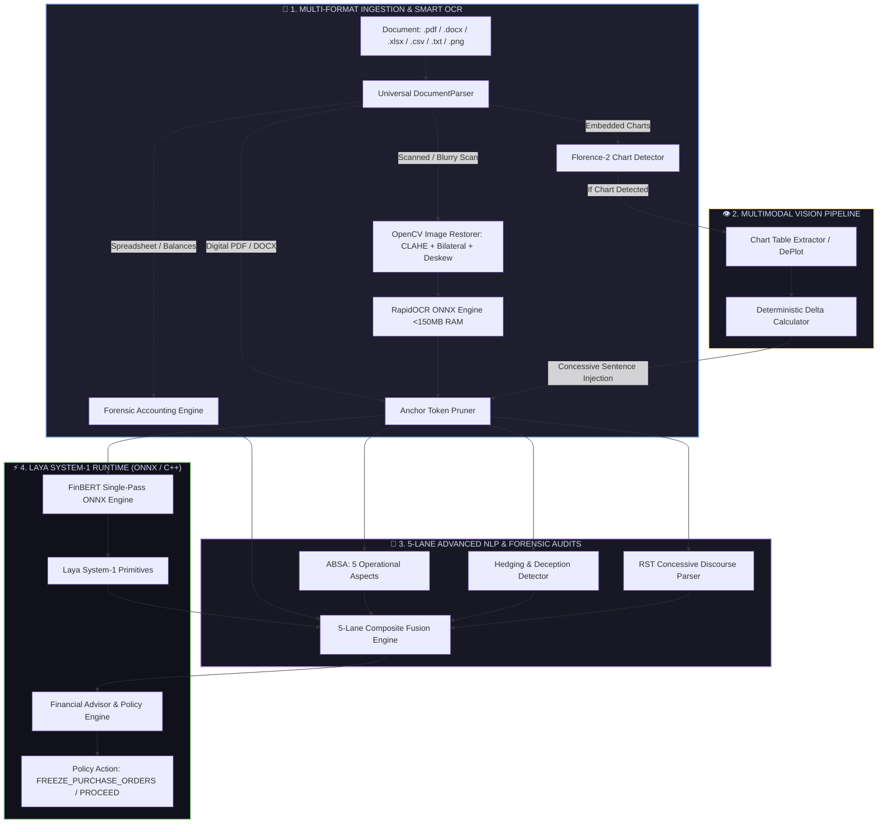

# Virdixt — Multimodal Financial Sentiment & Laya System-1 Decision Engine

<p align="center">
  
  
  
  
  
  
</p>

---

## 📌 Executive Summary

**Virdixt** is an air-gapped, enterprise-grade financial intelligence and automated risk-routing engine. Built on a fine-tuned **FinBERT** backbone and augmented with **Laya System-1 Decision Primitives**, Virdixt ingests unstructured enterprise documents (**PDFs**, **scanned receipts**, **Word DOCX**, **Excel workbooks**, **CSVs**, and **Images**), recovers degraded scans via OpenCV image restoration, parses financial charts, resolves complex multi-clause financial disclosures, and routes high-risk counterparties to automated ERP policy actions in sub-10 milliseconds.

> 📖 **Internal Architecture Walkthrough:** For a file-by-file visual breakdown, interactive dependency matrices, and step-by-step lifecycle explanations, see **[`ARCHITECTURE_WALKTHROUGH.md`](ARCHITECTURE_WALKTHROUGH.md)**.

---

## 🚀 Key Capabilities

* **🌐 Two-Page Web Audit Dashboard & Telemetry UI:** Modern split architecture (`index.html` for ingestion, `report.html` for visualization) with a collapsible navigation sidebar, live trace logs, multi-lane explainability bars, and an interactive "What-If" exposure slider.
* **🔍 Zero-Tax OCR & OpenCV Optical Image Restoration:** Dual-path ingestion:
  - **Fast Vector Path (<5ms, 0 MB RAM):** Uses `PyMuPDF` (`fitz`) for clean digital PDFs.
  - **Degraded Scan Fallback:** Automatically detects scanned/blurry pages, applies **CLAHE contrast equalization, bilateral edge-preserving denoising, morphological deskewing, and unsharp masking**, then extracts structured text via lightweight **RapidOCR ONNX** (<150MB RAM).
* **🔀 5-Lane Composite Fusion & Rule Engine (`nlp/fusion.py`):** Synthesizes intelligence across **Global FinBERT Sentiment**, **5-Aspect ABSA**, **Forensic Accounting (Altman Z / Beneish M / Piotroski F)**, **RST Discourse Masking**, and **Linguistic Hedging / Gunning-Fog Index**.
* **⚡ Single-Pass Neural Execution:** `LayaSystem1` computes calibrated probabilities, sentiment choices, continuous distress scores, and NOUL metrics in **1 single forward pass**, cutting CPU inference latency by $>70\%$.
* **Aspect-Based Financial Sentiment Analysis (ABSA):** Multi-entity token decomposition evaluating distinct operational aspects (`Top-Line & Growth`, `Cost & Margin Structure`, `Liquidity & Cash Burn`, `Debt & Solvency`, `Audit & Governance Risk`) independently.
* **Linguistic Deception & Executive Hedging Audit:** Computational linguistics engine measuring Epistemic Uncertainty scores, Agentless Passive Voice Evasion, Gunning-Fog Obfuscation indexes, and corporate euphemisms with memoized syllable parsing.
* **Rhetorical Structure Theory (RST) Concessive Parsing:** Identifies rhetorical masking by separating superficial *Satellites* (buffer clauses) from core *Nuclei* (dominant economic realities).
* **Deterministic Quantitative Forensic Accounting:** Microsecond calculations of institutional solvency benchmarks (**Altman Z-Score**, **Beneish M-Score**, **Piotroski F-Score**) with zero external dependencies.
* **Deterministic Chart-to-Table Vision Subsystem:** Detects financial graphs, extracts underlying tables, and computes exact percentage deltas to inject concessive commentary without visual hallucination.
* **Hierarchical Rule-Based Escalation & Circuit Breakers (`apply_overrides`):** Combines neural FinBERT predictions with deterministic short-circuit vetoes (e.g., Altman Z in *Distress Zone* forces unconditional escalation to `CRITICAL` / `FREEZE_PURCHASE_ORDERS`; Extreme Hedging language forces `WARNING`).
* **Document Completeness Engine (`evaluate_completeness`):** Audits signal availability across word counts, missing financial statements, and aspect coverage to assign institutional confidence badges (`FULL`, `PARTIAL`, `THIN`).
* **Financial Exposure & Priority Ranking:** Computes risk-adjusted dollar exposure ($\text{Priority} = \frac{\text{Distress Score}}{100} \times \text{Exposure Value}$) for enterprise triage.
* **Laya Open-Weights System-1 Primitives:**
  * **`Choice`:** Calibrated discrete sentiment classification (`NEGATIVE`, `NEUTRAL`, `POSITIVE`).
  * **`Score`:** Continuous Financial Distress Index $[0.0, 100.0]$ ($0 = \text{Peak Solvency}, 100 = \text{Imminent Distress}$).
  * **`Noul`:** Calibrated probability propositions ($P(\text{Liquidity Distress})$, $P(\text{Covenant Breach})$, $P(\text{Growth Momentum})$).
* **Automated ERP Policy Engine (`POLICY_TABLE`):** Strict deterministic mapping from risk grades to exposure tiers (`TIER_1_SAFE` to `TIER_4_BLOCKED`), policy action flags (`FREEZE_PURCHASE_ORDERS`, `FLAG_FOR_REVIEW`, `PROCEED_NORMAL`), and actionable operational directives.
* **🔒 100% Air-Gapped / Zero-Cloud Leakage:** Entire frontend (including `alpine.min.js`) is vendored locally. Operates entirely offline on standard CPU/GPU using native ONNX runtimes. Zero data ever leaves the local machine.

---

## 🏛️ System Architecture


```mermaid
flowchart TD
    subgraph INGESTION["📂 1. MULTI-FORMAT INGESTION & SMART OCR"]
        INPUT[Document: .pdf / .docx / .xlsx / .csv / .txt / .png] --> PARSE[Universal DocumentParser]
        PARSE -->|Digital PDF / DOCX| PRUNE[Anchor Token Pruner]
        PARSE -->|Scanned / Blurry Scan| ENHANCE[OpenCV Image Restorer: CLAHE + Bilateral + Deskew]
        ENHANCE --> OCR[RapidOCR ONNX Engine <150MB RAM]
        OCR --> PRUNE
        PARSE -->|Spreadsheet / Balances| FOR_ENG[Forensic Accounting Engine]
        PARSE -->|Embedded Charts| DETECT[Florence-2 Chart Detector]
    end

    subgraph VISION["👁️ 2. MULTIMODAL VISION PIPELINE"]
        DETECT -->|If Chart Detected| EXTRACT[Chart Table Extractor / DePlot]
        EXTRACT --> DELTA[Deterministic Delta Calculator]
        DELTA -->|Concessive Sentence Injection| PRUNE
    end

    subgraph AUDITS["🧠 3. 5-LANE ADVANCED NLP & FORENSIC AUDITS"]
        PRUNE --> ABSA[ABSA: 5 Operational Aspects]
        PRUNE --> HEDGE[Hedging & Deception Detector]
        PRUNE --> DISC[RST Concessive Discourse Parser]
        FOR_ENG --> FUSION[5-Lane Composite Fusion Engine]
        ABSA --> FUSION
        HEDGE --> FUSION
        DISC --> FUSION
    end

    subgraph DECISION["⚡ 4. LAYA SYSTEM-1 RUNTIME (ONNX / C++)"]
        PRUNE --> FINBERT[FinBERT Single-Pass ONNX Engine]
        FINBERT --> LAYA[Laya System-1 Primitives]
        LAYA --> FUSION
        FUSION --> ERP[Financial Advisor & Policy Engine]
        ERP --> ACTION[Policy Action: FREEZE_PURCHASE_ORDERS / PROCEED]
    end

    style INGESTION fill:#1e1e2e,stroke:#89b4fa,stroke-width:2px,color:#cdd6f4
    style VISION fill:#181825,stroke:#f9e2af,stroke-width:2px,color:#cdd6f4
    style AUDITS fill:#181825,stroke:#cba6f7,stroke-width:2px,color:#cdd6f4
    style DECISION fill:#11111b,stroke:#a6e3a1,stroke-width:2px,color:#cdd6f4
```

---

## 📊 Benchmark & Accuracy Metrics

Fine-tuned on a balanced 6,300-row master dataset ($1:1:1$ Negative / Neutral / Positive) assembled from authentic market feeds, institutional accounting statements, and adversarial multi-clause sentences:

| Evaluation Metric | Value | Baseline Comparison |
| :--- | :---: | :--- |
| **Validation Accuracy** | **90.26%** | $+15.26\%$ over unbalanced baseline |
| **Macro F1 Score** | **0.9022** | $+0.221$ over generic classifiers |
| **Negative Recall** | **88.64%** | **$\uparrow$ from 9.5%** (Prevents missed insolvency signals) |
| **Macro Precision** | **0.9027** | High confidence across all classes |
| **Inference Latency (ONNX CPU)** | **~5–10 ms** | Warm single-pass resident model throughput |
| **Inference Latency (ONNX GPU)** | **~1.5 ms** | Batch acceleration available |
| **RAM Footprint** | **< 200 MB** | 100% stable on 4 GB RAM systems |

### Validation Confusion Matrix (945 Samples)
```
                 Pred Negative   Pred Neutral   Pred Positive
Actual negative:     281 ✅           19             17
Actual neutral :      26            269 ✅           15
Actual positive:       7              8            303 ✅
```

---

## 💻 Quickstart Guide

### 1. Installation
```bash
git clone https://github.com/Humble-Librarian/Virdixt.git
cd Virdixt
pip install -r requirements.txt
```

### 2. Launch the Web Audit Dashboard
```bash
python server.py
```
Open your browser at **`http://localhost:8000`** to access the live dashboard, upload documents, inspect telemetry traces, and run what-if simulations.

### 3. Command-Line Inference (Any Document)
```bash
# Analyze a digital PDF, scanned image, Excel sheet, DOCX, CSV, or TXT
python infer.py --file "data/sample_reports/corporate_filing.xlsx"

# Analyze raw corporate text with financial exposure dollar value
python infer.py --text "Although revenue rose by 14%, cash flow turned deeply negative." --exposure 500000
```

### 4. Run the Full Test Suite
```bash
# Run 14 integration, API, completeness, and override tests
python -m pytest tests/

# Run OCR & optical image restoration verification test
python test_ocr_pipeline.py
```

---

## 📁 Repository Structure

```
Virdixt/
├── nlp/                         # Advanced Computational Linguistics & Forensic Math
│   ├── absa_engine.py          # 5-Aspect operational sentiment decomposition
│   ├── linguistic_hedging.py   # Epistemic hedging & Gunning-Fog obfuscation detector
│   ├── discourse_parser.py     # Rhetorical Structure Theory (RST) Nucleus parser
│   ├── forensic_accounting.py  # Deterministic Altman Z, Beneish M, Piotroski F
│   └── fusion.py               # 5-Lane Composite Fusion & institutional rule engine
├── vision/                      # Optical Restoration, OCR & Chart Processing
│   ├── image_enhancer.py       # OpenCV CLAHE, bilateral filter, deskew & unsharp
│   ├── ocr_engine.py           # RapidOCR ONNX engine with geometric layout sorter
│   ├── delta_calculator.py     # Deterministic table & chart sentencification
│   ├── chart_detector.py       # Visual chart bounding box detector
│   └── pipeline.py             # End-to-end multimodal injection pipeline
├── static/                      # Interactive Web Audit Dashboard & Telemetry UI
│   ├── index.html              # Ingestion node & analysis trigger
│   ├── report.html             # Multi-panel analysis dashboard with sidebar navigation
│   ├── styles.css              # Custom styling, responsive layout, & active states
│   ├── app.js                  # Reactive state bridge via sessionStorage & Alpine.js
│   └── alpine.min.js           # Vendored dependency for 100% offline/air-gapped operation
├── tests/                       # Automated Test Suite (Pytest)
│   ├── test_advise_integration.py # End-to-end decision advisor tests
│   ├── test_api.py             # FastAPI REST endpoints test
│   ├── test_completeness.py    # Signal completeness badge tests
│   └── test_overrides.py       # Safety circuit-breaker override tests
├── document_parser.py           # Master multi-format ingestion (PDF, DOCX, XLSX, CSV, IMG)
├── server.py                    # Non-blocking FastAPI backend server
├── infer.py                     # CLI runtime, FinBERT single-pass ONNX & ERP advisor
├── train.py                     # Custom PyTorch class-weighted fine-tuning script
├── eval.py                      # Comprehensive classification report & metrics
├── export_onnx.py               # Freezes PyTorch weights into optimized ONNX graph
├── test_ocr_pipeline.py         # Verification test suite for degraded scan OCR
└── requirements.txt             # Core dependencies (Torch, ONNX, OpenCV, RapidOCR)
```

---

## 📄 License
This project is licensed under the MIT License — see the [LICENSE](LICENSE) file for details.
